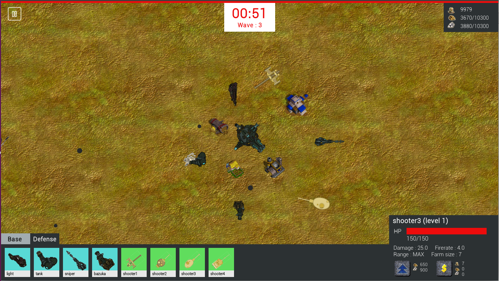

The Last Wish
==================



This is the final project of Programming Method class in Chulalongkorn University.

The Last Wish is the game written with Java language.
Using JFrame as a library to render object to screen. No other library use.
Some animation and image reader are implement by my own.

## Work

- Animation implements by my own using `while(1)` and `sleep` time to refresh framerate of game.
- Image animation written by me. But the reader part using the other code.
- `src/render` is collecting of renderable object that display to screen.
- `src/object` the object information, calculate behind the game process.
- The object hitting detection using [Euclidean distance](https://en.wikipedia.org/wiki/Euclidean_distance) implementation.
All object are represent as a circle object for fast and easy detection checking.
- Memory pooling is the main part of speed up game performance.


## Game Concept

- You play as a king, who protect the zombie which spawn around you base.
- You must handle the resource and money to build the resource base or some attacker base
to kill the zombies before it's invasion.
- Each level will more harder and spawn new type of zombie.
- Play the best as possible for reach to higher level. 

## Author

This project develop by a group project consists of two students in each group.

- Kosate Limpongsa (Me)
- Weeraphat Jungsomjatepaisal [@5731100221-WJ](https://github.com/5731100221-WJ)

## Usage

```
java -jar The_Last_Wish.jar
```

Have fun :D
